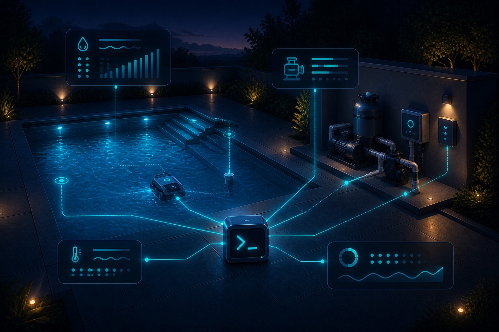

<p align="center">
  
</p>

# poolctl

`poolctl` is a small Python CLI for inspecting and operating a Pentair
ScreenLogic pool system over the local network. It discovers and remembers the
adapter, renders compact equipment state, exposes structured JSON, and provides
guarded cleaner and delay controls.

> [!WARNING]
> `poolctl` controls pumps and pool equipment through a local, unofficial
> ScreenLogic integration. Keep people clear of equipment, preserve working
> physical controls, and do not use this project for unattended safety-critical
> automation.

## What it does

- discovers a ScreenLogic adapter on the local subnet;
- reads controller, body, circuit, pump, and sensor state;
- reports cleaner and system-delay state;
- turns the cleaner on or off after an explicit `--yes` guard;
- cancels active delays after an explicit `--yes` guard;
- cancels a cleaner delay before enabling the cleaner, then reports final state.

Python 3.11 or newer is required.

## Install

```bash
cd /path/to/private/home-config
./bin/bootstrap-ctls poolctl
```

The private `home-config` bootstrap is the canonical installer: it populates the
real adapter inventory, calls this repository's stable `script/install`
contract, and creates `/usr/local/bin/poolctl` backed by an isolated system
environment under `/usr/local/lib/home-config/ctls`.

## Configure private adapter data

Run discovery once on the same LAN as the ScreenLogic adapter:

```bash
poolctl discover
```

The selected adapter is saved to `/usr/local/config/poolctl/config.json` with mode
`0600`. Set `POOLCTL_CONFIG=/path/to/config.json` to use another private file,
or pass `--host 192.0.2.10` before a command for a one-off host override.

Adapter IPs, names, and site topology are private deployment data. Keep real
values in a private configuration repository, not in a public fork. A sanitized
shape is provided in [`config/adapter.example.json`](config/adapter.example.json).

## Inspect state

```bash
poolctl status
poolctl circuits
poolctl bodies
poolctl pumps
poolctl cleaner status
poolctl delay status
```

Add `--json` after a command for structured output. `poolctl status --raw`
prints the adapter payload for protocol diagnosis and may include private local
topology, so review it before sharing.

## Control the cleaner and delays

```bash
poolctl cleaner on --yes
poolctl cleaner off --yes
poolctl delay cancel --yes
```

Write commands refuse to run without `--yes`. Cleaner enable checks delay state,
cancels an active cleaner delay, performs the circuit write, and reads status
again before reporting success. See [operations](docs/operations.md) for the
full behavior and safety boundary.

## Runtime data

| Data | Default path | Git policy |
| --- | --- | --- |
| Adapter cache | `/usr/local/config/poolctl/config.json` | Private config repo only |
| Raw status output | Standard output only | Review before sharing |

`poolctl` does not require a cloud username, password, or token.

## Reliability and scope

ScreenLogic discovery is LAN-bound, and equipment names and supported sensors
vary by controller configuration. `poolctl` deliberately exposes only the
cleaner circuit and delay cancellation as writes; it is not a general arbitrary
circuit-toggle interface.

See [protocol notes](docs/protocol.md), [troubleshooting](docs/troubleshooting.md),
and the [roadmap](docs/roadmap.md) for more detail.

## Control-tool family

- [`gatectl`](https://github.com/cnberry/gatectl) — MyQ gate and garage-door
  status with guarded open/close.
- [`poolctl`](https://github.com/cnberry/poolctl) — Pentair ScreenLogic status,
  cleaner, and delay control.
- [`hottubctl`](https://github.com/cnberry/hottubctl) — Sundance SmartTub
  temperature and freshness inspection.
- [`switchctl`](https://github.com/cnberry/switchctl) — named local switch
  status and guarded power control.

Current and future `*ctl` tools favor small commands, private configuration,
readable output, safe JSON, guarded writes, post-write readback, a repo-owned
`script/install`, and explicit uncertainty.

## Development

```bash
python3 -m venv .venv
.venv/bin/python -m pip install -e ".[dev]"
.venv/bin/ruff format --check poolctl tests
.venv/bin/ruff check poolctl tests
.venv/bin/detect-secrets scan --baseline .secrets.baseline
.venv/bin/pytest -q
```

Unit tests cover configuration, selection logic, rendering, and protocol
constants without contacting live pool equipment. `just test-integration` only
checks the installed command surface; live hardware validation remains manual.

## License

`poolctl` is released under the [MIT License](LICENSE).
